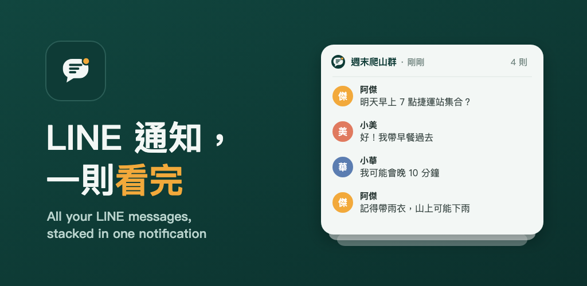

# Better Line Notification

LINE 只會顯示每個聊天室的「最新一則」通知。Better Line Notification 把同一個聊天室最近的訊息疊成一則通知，一次看完，不會送出已讀。

LINE only shows the newest message of each chat in its notifications. Better Line Notification stacks a chat's recent messages into one notification, so you can read them all without opening LINE or sending a read receipt.

> 非 LINE 官方 app，與 LINE / LY Corporation 無關。LINE 是 LY Corporation 的商標。
> Not affiliated with LINE or LY Corporation. LINE is a trademark of LY Corporation.

## 下載 Download

到 [Releases](../../releases/latest) 下載最新的 `BetterLineNotification-x.y.z.apk`。需要 Android 8.0 以上。

Download the latest `BetterLineNotification-x.y.z.apk` from [Releases](../../releases/latest). Requires Android 8.0+.

## 安裝步驟（繁體中文）

1. 在手機上下載 APK，點開安裝。若出現「為了安全起見，你的手機不允許安裝這個來源的 app」，請依畫面允許該 app（瀏覽器或檔案管理器）安裝。
2. 打開 Better Line Notification，點「前往設定」開啟**通知存取權**。
3. **如果開關是灰色、或出現「受限制的設定」**：這是 Android 13 以上對「從檔案安裝」的 app 的保護。請到 設定 → 應用程式 → Better Line Notification → 右上角 ⋮ → **允許受限制的設定**，再回去開啟通知存取權。
4. 回到 app，允許傳送通知。
5. 建議：在「應用程式資訊 → 電池」選「不受限制」。Samsung 手機另請到 設定 → 電池 → 背景使用限制 → **永不休眠的應用程式**，加入本 app，避免系統把它暫停。

## Install (English)

1. Download the APK on your phone and open it. If Android blocks installs from that source, allow it for your browser or file manager.
2. Open Better Line Notification and tap "Open settings" to turn on **notification access**.
3. **If the switch is greyed out or you see "Restricted setting"**: Android 13+ protects apps installed from a file. Go to Settings → Apps → Better Line Notification → ⋮ (top right) → **Allow restricted settings**, then turn notification access on.
4. Back in the app, allow notifications.
5. Recommended: App info → Battery → **Unrestricted**. On Samsung, also add it under Settings → Battery → Background usage limits → **Never auto sleeping apps**.

## 更新 Updates

新版本會發布在 [Releases](../../releases)。想自動收到更新，可以安裝免費的 [Obtainium](https://github.com/ImranR98/Obtainium)，加入這個頁面的網址。

New versions are published under [Releases](../../releases). For automatic updates, add this page's URL to the free [Obtainium](https://github.com/ImranR98/Obtainium) app.

## 隱私 Privacy

本 app **沒有網路權限**，無法把任何資料傳出手機；訊息只存在手機裡。完整說明：[隱私權政策](https://waynelai0127.github.io/better-line-privacy/)。

The app has **no internet permission**, so it can't send anything off your phone; messages stay on the device. Full details: [privacy policy](https://waynelai0127.github.io/better-line-privacy/).

## 聯絡 Contact

fssher107@gmail.com
